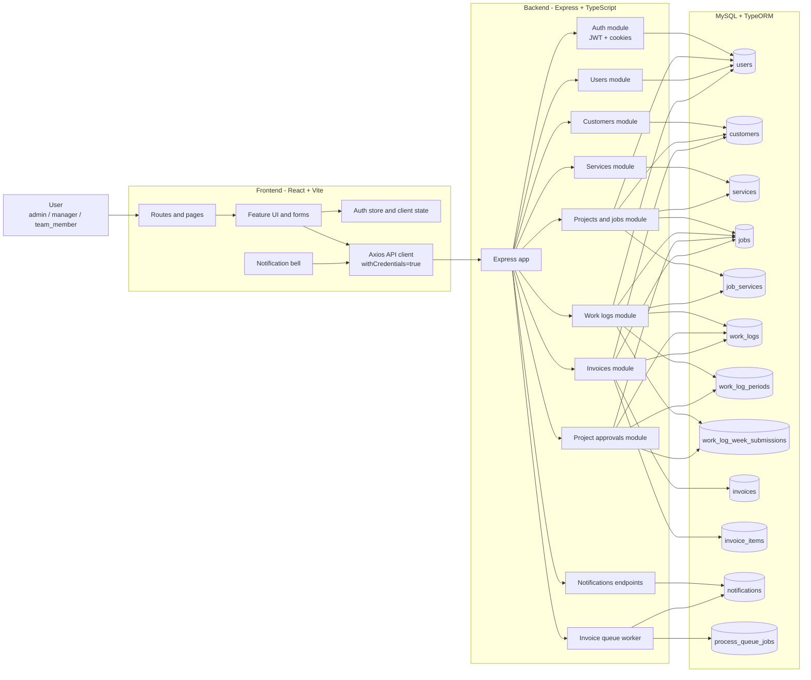
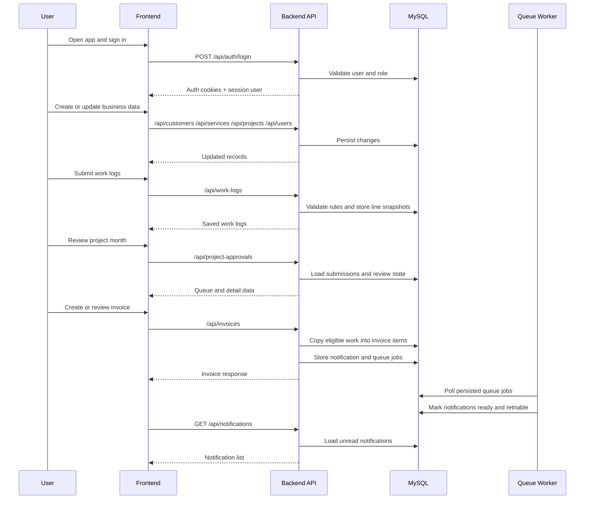

# Architecture

## System Overview

## Main Runtime Flow

## High-Level Responsibilities

- The frontend handles routing, forms, role-aware navigation, and periodic notification polling.
- The backend owns all business rules, validation, auth, approval logic, invoice lifecycle rules, and queue processing.
- MySQL is the source of truth for users, operational records, invoice data, notifications, and persisted queue jobs.
- TypeORM migrations are the expected way to evolve schema and bootstrap required data.

## Current Boundaries

- Frontend talks only to the backend API through `VITE_API_BASE_URL`.
- Auth is cookie-based, so frontend and backend local origins must be configured correctly.
- The invoice queue worker runs inside the backend process rather than as a separate service.
- Project and job terminology overlap in the codebase because the router preserves older naming compatibility.
